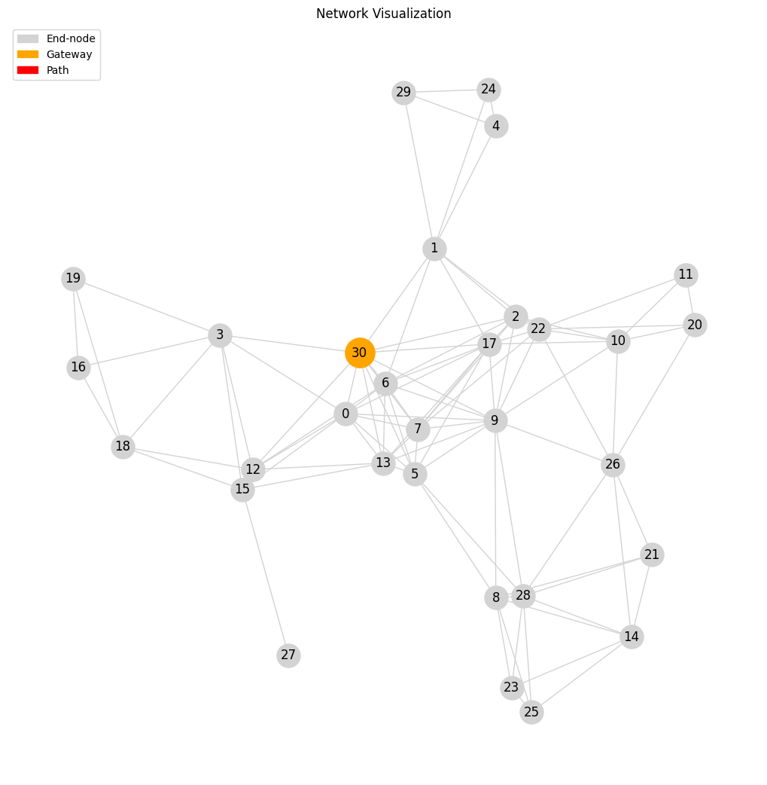
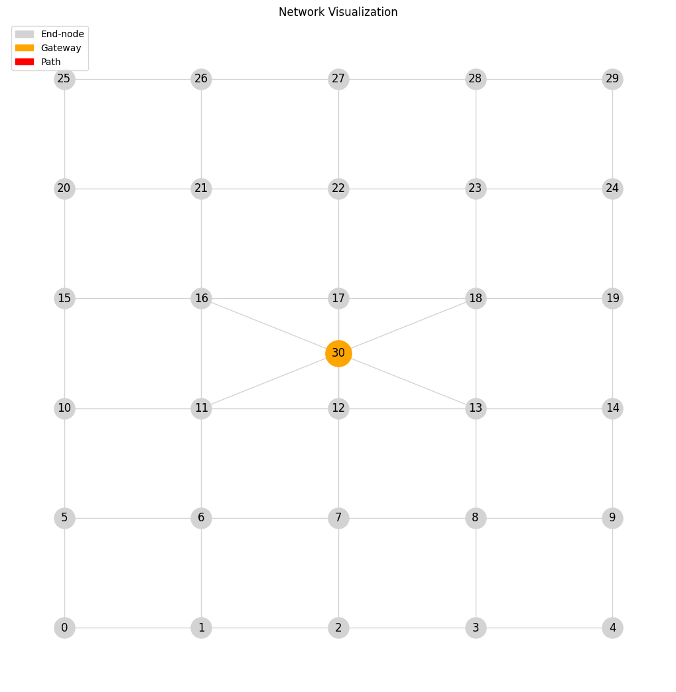

# MABs-Dynamic-Routing-WSNs
This project's paper focuses on single-hop Wireless Sensor Networks (WSNs), in particular how the inherent single-hop constraint can be relaxed to enable multi-hop routing. The underlying objective is extending the current geographic coverage limits of WSNs, imposed by the single-hop to gateway constraint, to larger geographic areas where end-nodes route packets to an available gateway. The proposed approach leverages MABs to build an adaptive dynamic routing mechanism. This contribution constitutes the project work for the class `INF567 - "Wireless networks: from cellular to connected objects"` at École Polytechnique. The document ` Sensor_Networks_Dynamical_routing_adaptation_via_MABs` provides a detailed analysis of the project, experimental results and future extensions. A notebook with the experiments is provided in the file `toy_test.ipynb`.

# Examples of network topologies

